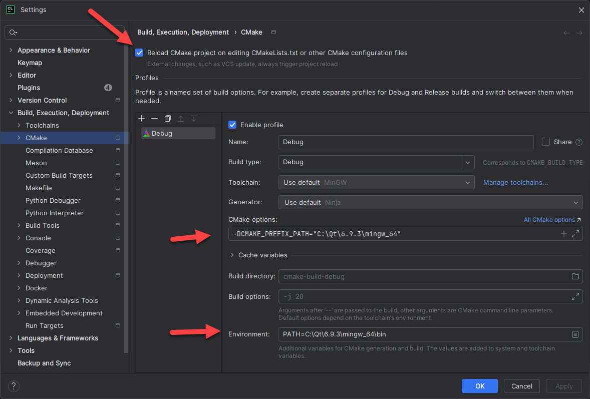
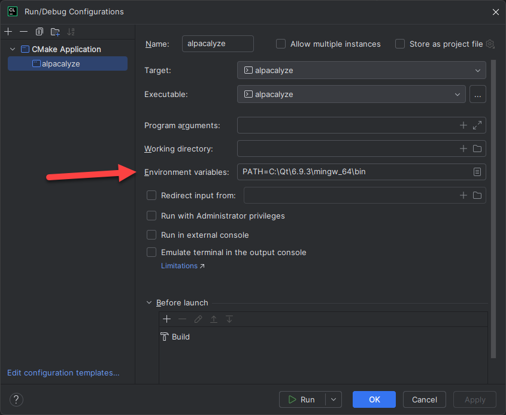
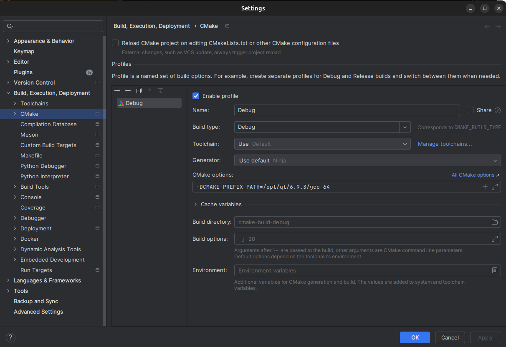

# Setup CLion for RhenoCalc

To be able to run and debug the Qt Application natively from CLion.

## Windows

### Settings in Build, Execution, Deployment - CMake


Enter the Qt build path, see example below (modify according to your system)

CMake options: ````-DCMAKE_PREFIX_PATH="C:\Qt\6.9.3\mingw_64````

Environment: ````PATH=C:\Qt\6.9.3\mingw_64\bin````

### Settings in Edit Configuration - Debug


Environment variables: ````PATH=C:\Qt\6.9.3\mingw_64\bin````

## Ubuntu

### Settings in Build, Execution, Deployment - CMake


Enter the Qt build path, see example below (modify according to your system)

CMake options: ````-DCMAKE_PREFIX_PATH=/opt/qt/6.9.3/gcc_64````